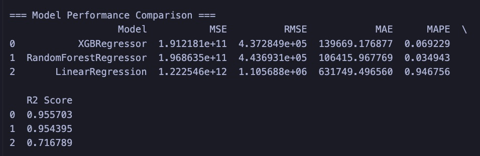
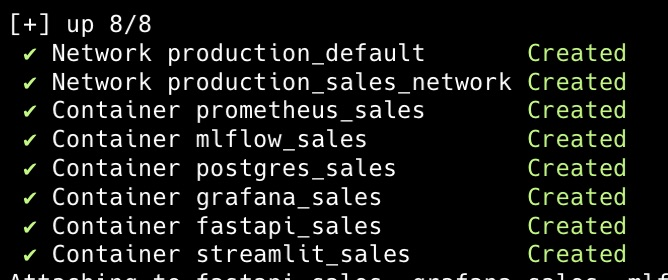

## 📊 Project structure for enterprise Supermarket Sales Prediction flows

- Build Machine Learning models to help LLM judge prediction for reason
    - Build machine learning models using regressor algorithm for sales prediction
        - LinearRegression
        - XGBRegressor
        - RandomForestRegressor
    - Build entity Fraud prediction using ML models and analysis factor to integrate with streamlit
    - Build entity Abuse detection for production using ML models and analysis factor to integrate with streamlit
    - Build entity Security agent to fast investigate on LLM analysis in main app
- Build LLM end-to-end
    - Choose an LLM to fine-tune based on cost, resources, latency, security and accurate on answering to users
    - Host the LLMs or cloud server
    - Develop LLM Powered application to ensure deployed on production and proper testing
- Observability setup to monitor latency, logging Machine learning models and LLMs Fine-tuned
- Build Streamlit for User Interface Forecasting dashboard
- Alert using slack to notify on error logging in models, LLMs, & servers
- CI/CD setp to deploy for all evaluation benchmarks passed. To integrate recycle provided system deployment
- Streamlit Deployment
- Optional -> Deploy to render cloud or railway cloud
- Build agentic AI for scalabling system

## 📝 Notes
- In practice, strong RAG evaluation combines:
    - Retrieval checks → Did we fetch the right information?
    - Answer checks → Did we explain it correctly?
    - Continuous testing → Are we improving over time?

## 👨‍💻 Engineering Logs

1. Machine Learning models result
    
    
2. Has a database in Postgresql as engineering.supermarket
    
    
3. Docker created ML system tools for end-to-end
    

## ⚙️ Service tools
1. Slack
2. Streamlit
3. Docker
4. FastAPI
5. MLFlow
6. Grafana
7. Prometheus
8. PostgreSQL
9. Github actions
10. Kubernetes